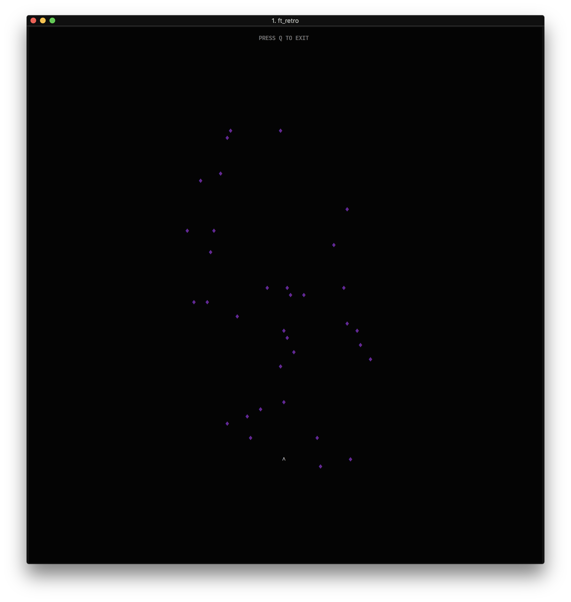

# simple-space-shooter

A very very basic space shooter built in C++ to practice while learning the language and working with OOP.

## Setup

```Shell
git clone https://github.com/pdeguing/simple-space-shooter.git
cd simple-space-shooter
make
./ft_retro
```


